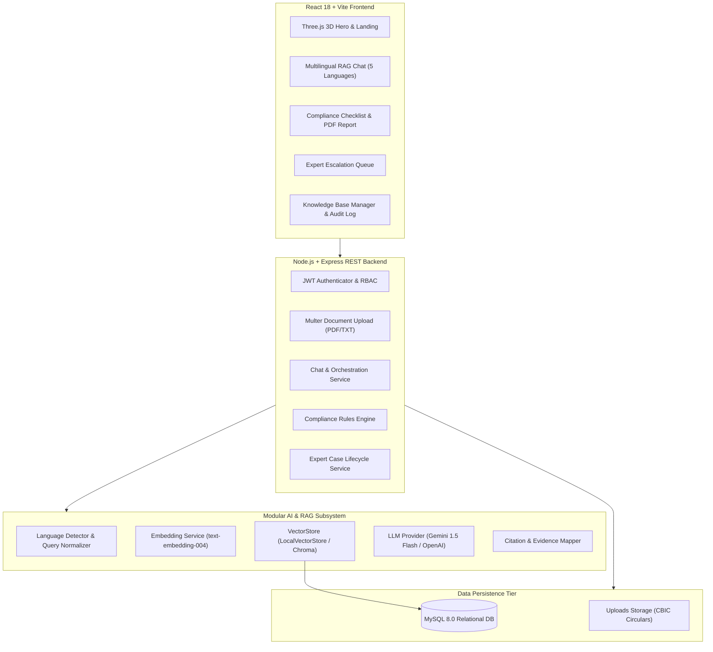

# GST Saarthi AI (जीएसटी सारथी)
> **"Your Multilingual AI GST Compliance Assistant"**

[](#)
[](#)
[](#)

---

## 1. Project Overview

**GST Saarthi AI** is an enterprise-grade legal compliance assistant designed specifically for India's 63+ million Micro, Small, and Medium Enterprises (MSMEs). Navigating Goods and Services Tax (GST) rules, Central Board of Indirect Taxes and Customs (CBIC) circulars, Input Tax Credit (ITC) conditions, and return-filing deadlines is notoriously complex—especially when official documents are published in dense legal English.

GST Saarthi AI bridges this gap through:
1. **Multilingual Regional Accessibility:** Conversational assistance across **English, Hindi (हिन्दी), Tamil (தமிழ்), Telugu (తెలుగు), and Bengali (বাংলা)**.
2. **Grounded RAG Architecture:** Answers are derived strictly from official CBIC notifications, circulars, and the CGST Act 2017 with verifiable, card-based citations (circular number, section, and page).
3. **Business Profile Conditioning:** Automatically adapts legal threshold guidance (₹20L vs. ₹40L exemption limits, composition rules, e-way bills) based on the MSME's state, turnover, and sector.
4. **Actionable Compliance Checklist Engine:** Automatically generates statutory checklists with specific due dates and printable/downloadable compliance certificates.
5. **Human-in-the-Loop Escalation:** Seamless 1-click escalation to certified GST practitioners and Chartered Accountants for audit notices, complex litigation, or penalties.
6. **Immutable Auditability:** Enterprise-grade audit logging tracking user queries, retrieved chunks, business context, and expert resolutions.

---

## 2. System Architecture



---

## 3. Technology Stack

### Frontend
* **React 18 + Vite** (Fast build, modern component architecture; NO Next.js)
* **Tailwind CSS** (Custom enterprise design system: Deep Indigo `#1E1B4B`, Emerald `#059669`, slate surfaces)
* **Three.js** (`ComplianceNetwork.jsx` 3D glowing interconnected legal nodes)
* **Recharts** (Donut compliance health gauge, category breakdown, query distribution)
* **Lucide React** (Modern clean icons)
* **Axios & React Router v6**
* **React Hot Toast** (Instant micro-interaction feedback)

### Backend
* **Node.js & Express.js** (Layered Clean Architecture: Routes $\to$ Controllers $\to$ Services $\to$ Repositories)
* **JWT & bcryptjs** (Secure authentication, hashed credentials, role authorization)
* **Multer** (Official CBIC document ingestion: PDF, TXT, DOCX)
* **Helmet, CORS & express-rate-limit** (Production-grade security headers & rate limiting)

### Database
* **MySQL 8.0 (InnoDB)** with 16 normalized tables, foreign key constraints, indexes, and full audit logs.

### Modular AI & RAG
* **AI Provider Abstraction:** Google Gemini (`gemini-1.5-flash`), OpenAI (`gpt-4o-mini`), and deterministic offline GST reasoning engine (`MockProvider`).
* **Vector Store Abstraction:** `LocalVectorStore` (Cosine similarity on normalized float32 vectors) and pluggable Chroma support.
* **Multilingual Router:** Unicode script detection and query expansion across Hindi, Tamil, Telugu, Bengali, and English.

---

## 4. Database Structure

Full SQL schemas and seed files are provided in `database/schema.sql` and `database/seed.sql`:

```text
users                    -> User credentials, roles (USER, EXPERT, ADMIN), language
business_profiles        -> MSME name, turnover, state, GSTIN, composition flag
conversations            -> Multi-turn chat sessions
messages                 -> Chat bubbles (USER, AI, EXPERT) with confidence scores
documents                -> Curated CBIC notifications, circulars, CGST rules
document_chunks          -> Semantic text partitions for vector retrieval
message_sources          -> Citation links between AI messages and document chunks
expert_requests          -> Escalated tickets (TKT-YYYY-XXXX), status lifecycle
expert_request_messages  -> Bilateral messaging between MSME and GST practitioner
expert_notes             -> Internal private working papers for experts
checklist_templates      -> Statutory rule matrix with JSON applicability logic
checklists               -> Generated compliance trackers for MSMEs
checklist_items          -> Specific statutory obligations with due dates & completion
notifications            -> In-app alerts for deadlines and expert replies
user_preferences         -> UI themes and alert configurations
audit_logs               -> Immutable compliance event logs
```

---

## 5. Local Setup & Installation

### Prerequisites
* **Node.js**: v18.0.0 or higher
* **MySQL**: 8.0 (or Docker)
* **npm** or **yarn**

### Step 1: Database Setup
Start MySQL locally or via Docker:
```bash
# Option A: Using Docker Compose
docker-compose up -d

# Option B: Using local MySQL instance
mysql -u root -p -e "CREATE DATABASE IF NOT EXISTS gst_saarthi;"
mysql -u root -p gst_saarthi < database/schema.sql
mysql -u root -p gst_saarthi < database/seed.sql
```

### Step 2: Backend Setup
```bash
cd server
npm install

# Configure environment variables (optional: add your GEMINI_API_KEY)
cp .env.example .env

# Optional: Run the automated DB initializer
npm run init-db

# Start the Express API server
npm run dev
# Server will run on: http://localhost:5000
```

### Step 3: Frontend Setup
```bash
cd ../client
npm install

# Start the Vite development server
npm run dev
# Client will run on: http://localhost:5173
```

---

## 6. Demo Accounts (Hackathon 1-Click Login)

The login page (`/login`) includes **1-Click Demo Buttons** for instant evaluation:

| Role | Name | Email | Password | Persona Details |
| :--- | :--- | :--- | :--- | :--- |
| **USER (MSME)** | Ramesh Sharma | `sharma.retail@example.com` | `Password123!` | Sharma Garments, Retail trader in Delhi, Turnover ₹35 Lakhs, Hindi |
| **EXPERT** | CA Priya Mehta | `priya.mehta@gstexpert.in` | `Password123!` | Certified GST Practitioner, reviewing notices & escalations |
| **ADMIN** | Compliance Officer | `admin@gstsaarthi.in` | `Password123!` | Knowledge Base Curator, CBIC Ingestion & Audit Logs |

---

## 7. Demo Scenarios for Jury Evaluation

### Scenario 1: English Registration Threshold Inquiry
* **User Question:** *"My business turnover is ₹35 lakh and I sell garments in Delhi. Do I need GST registration?"*
* **AI Output:** Clearly explains that under **CBIC Notification No. 10/2019-Central Tax**, suppliers of goods in normal states enjoy an exemption limit of ₹40 Lakhs. Cites **CGST Act Section 22(1)**.

### Scenario 2: Hindi Composition Scheme & ITC Restriction
* **User Question:** *"मैं composition scheme में हूँ। क्या मैं input tax credit claim कर सकता हूँ?"*
* **AI Output:** Responds in Hindi. Highlights that under **Section 10(4) of the CGST Act 2017**, composition dealers are legally barred from claiming Input Tax Credit or issuing tax invoices. Cites Section 10.

### Scenario 3: Tamil Registration Inquiry
* **User Question:** *"எனது வணிகத்திற்கு GST பதிவு தேவையா?"*
* **AI Output:** Responds in Tamil explaining the ₹40 Lakh goods vs. ₹20 Lakh services threshold.

### Scenario 4: Telugu ITC Claim Verification
* **User Question:** *"నేను input tax credit ఎలా claim చేయాలి?"*
* **AI Output:** Responds in Telugu outlining conditions under Section 16(2) and GSTR-2B matching under Circular 183/2022.

### Scenario 5: Bengali Return Filing Schedule
* **User Question:** *"আমার GST return কখন file করতে হবে?"*
* **AI Output:** Responds in Bengali with GSTR-1 (11th) and GSTR-3B (20th) filing timelines.

### Scenario 6: Follow-up Context & Expert Escalation
* User enters follow-up facts: *"My turnover is ₹35 lakh"* $\to$ *"I sell clothes in Delhi"* $\to$ *"What should I do?"*
* AI maintains context across conversation turns. User clicks **"Escalate to Expert CA"** to create ticket `TKT-2026-XXXX`.
* Jury switches to **CA Priya Mehta** account to view the case file, write formal legal advice, and update the status timeline.

---

## 8. Security & Legal Disclaimer

* **Password Security:** Salted bcrypt hashing (`cost=10`).
* **API Protection:** JWT verification, role-based access guards (`USER`, `EXPERT`, `ADMIN`), rate-limiting, and sanitized inputs.
* **Disclaimer:** *GST Saarthi AI provides informational compliance guidance grounded in official CBIC documents. It does not constitute formal legal or tax audit advice. Users should consult certified professionals for contested assessments.*
